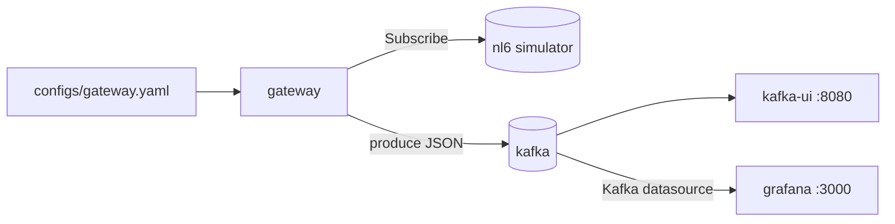
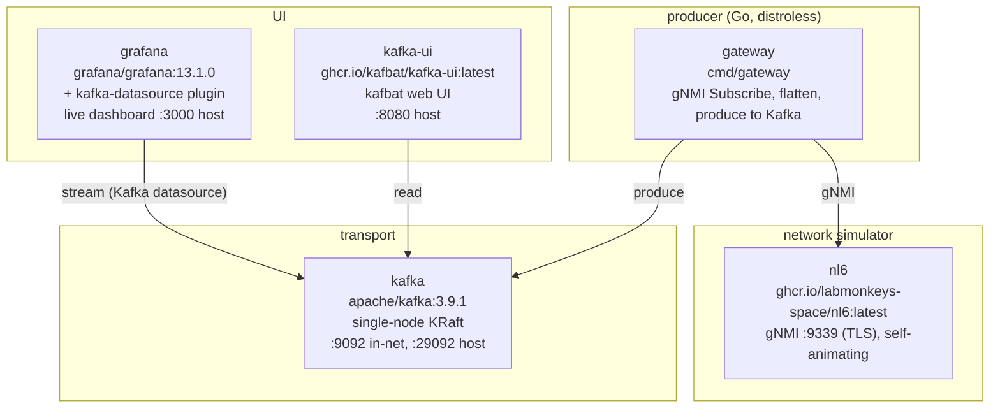

# gnmi-kafka-producer

Docker Compose stack that streams gNMI telemetry from a network simulator into
Kafka. The gateway reads a single YAML config and can be deployed and
reconfigured independently.



## Components



## Quickstart

```sh
make up                       # docker compose up -d --build
make ps                       # watch services come healthy
open http://localhost:8080    # kafbat: cluster "demo", topic "gnmi.telemetry"
open http://localhost:3000    # grafana: "gNMI Telemetry (live)" dashboard (anonymous)
```

[nl6](https://nl6.eu) boots in seconds and emits self-animating telemetry
(cycling interface counters, sine-wave CPU/mem/temp), so there is no separate
stimulus generator — the data moves on its own. The gateway shares nl6's network
namespace (`network_mode: "service:nl6"` in the compose file) so it can dial
nl6's per-device gNMI endpoints.

## Configuration

The gateway is configured by a single file, [`configs/gateway.yaml`](./configs).

```yaml
kafka:  { brokers: ["kafka:9092"], topic: gnmi.telemetry }
gnmi:   { port: 9339, username: "", password: "",
          skip_verify: true, encoding: json_ietf, sample_interval: 5s }
paths:  [/interfaces/interface[name=*]/state/oper-status,
         /interfaces/interface[name=*]/state/counters/in-octets, ...]
hosts:  [192.168.100.1]
```

nl6 exposes the OpenConfig `interfaces` model (read-only) over gNMI on port 9339,
with a self-signed cert (`skip_verify: true`) and no authentication.

- **Add devices**: bump `-auto-count` on the `nl6` service in `e2e/compose.yml`
  and add the extra `192.168.100.x` addresses to `hosts:`. The gateway dials all
  hosts concurrently.
- **Change paths or sample interval**: edit `configs/gateway.yaml`, then
  `docker compose -f e2e/compose.yml restart gateway`. No rebuild. See
  [nl6's gNMI reference](https://nl6.eu) for the full leaf list (ifindex,
  admin/oper-status, last-change, and the complete `counters/*` set).
- **Point at a real device**: give the `gateway` its own network instead of
  `network_mode: "service:nl6"`, put the device address in `hosts:`, and ensure
  the gateway container can route to it.

## Output format

One JSON record per leaf Update, keyed by `device|interface|leaf`. The record is
**enriched for direct visualization**: the metric identity is promoted to `device`
and `interface` labels, and the value is emitted under a metric-named key so the
Grafana Kafka datasource plugin turns each numeric field into a named series.

```json
{
  "device":        "192.168.100.1",
  "interface":     "TenGigE0/0/0/0",
  "in_octets":     89115667333884,
  "in_octets_bps": 8123.4,
  "timestamp":     "2026-06-26T08:10:01.234567890Z"
}
```

- **Labels** — `device` (the host string from config) and `interface` (parsed from
  the gNMI path key) are strings, so the plugin treats them as series labels.
- **Metric key** — the leaf name with `-`→`_` (e.g. `in_octets`), carrying the raw
  value as a JSON number.
- **Rate** — for octet counters, `<metric>_bps` = Δvalue ÷ Δt × 8 is computed at the
  source (the gateway keeps the last sample per series). It is omitted on the first
  sample and on a counter reset.
- **Status** — `oper-status`/`admin-status` are emitted as numeric `oper_status`/
  `admin_status` (`UP` → 1, otherwise 0) so they are chartable.
- **Deletes** evict the series' rate state and produce no record.

> **Breaking change**: this replaces the earlier flat `{target, path, value}` record.
> Any consumer of the old shape must be updated. Only `kafka-ui` (schema-agnostic) and
> the Grafana dashboard read this topic in the demo.

## Commands

```sh
make logs                                  # tail all services
make tail-topic                            # console-consumer dump of first 50 records
docker compose -f e2e/compose.yml logs -f gateway
docker compose -f e2e/compose.yml logs -f nl6
make down                                  # tear down
```

## Project layout

```
.
├── configs/
│   └── gateway.yaml          # gateway config
├── e2e/
│   ├── compose.yml           # end-to-end demo stack
│   └── grafana/              # provisioned datasource + live dashboard
├── Makefile
├── README.md
├── go.mod / go.sum
├── cmd/
│   └── gateway/              # subscribe loop, one goroutine per host
│       ├── Dockerfile
│       └── main.go
└── internal/
    ├── config/
    │   ├── config.go         # shared field types + YAML loader
    │   └── gateway.go        # Gateway type, LoadGateway, validate
    ├── gnmi/
    │   ├── client.go         # dial-with-retry, SubscribeRequest builder
    │   └── flatten.go        # gNMI Notification to []Record, TypedValue cases
    └── kafka/producer.go     # franz-go wrapper
```

## Notes

- nl6 puts each simulated device on its own IP inside a Linux TUN/network
  namespace, not on the container's default interface. The `gateway` joins that
  namespace via `network_mode: "service:nl6"` to reach `192.168.100.x:9339`;
  Kafka stays reachable because nl6 is on the compose bridge network.
- nl6's gNMI is read-only (Capabilities/Get/Subscribe; no Set) and serves TLS
  with a self-signed cert, so the gateway uses `skip_verify: true` and no
  credentials.
- Kafka data lives in the container layer. `make down` wipes everything.
- `kafka:3.9.1` is pinned. `nl6` and `kafka-ui` track `latest`. Change in
  `e2e/compose.yml`.
