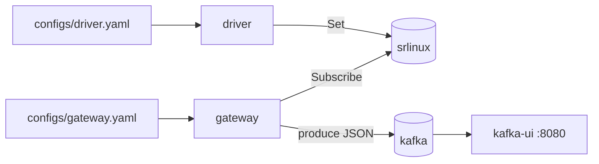
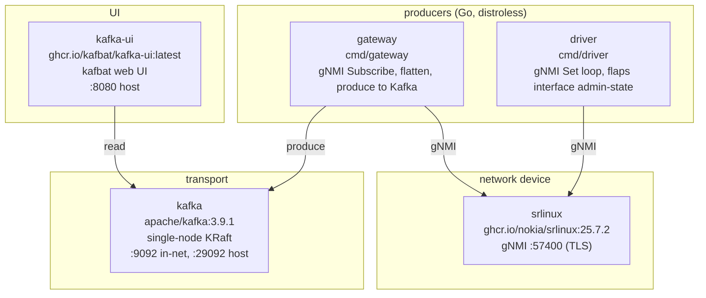

# gnmi-kafka-producer

Docker Compose stack that streams gNMI telemetry from network devices into
Kafka. Each service reads its own YAML config so the gateway and driver can be
deployed and reconfigured independently.



## Components



## Quickstart

```sh
make up                       # docker compose up -d --build
make ps                       # watch services come healthy
open http://localhost:8080    # kafbat: cluster "demo", topic "gnmi.telemetry"
```

SR Linux cold boot takes 5-15 min on a laptop (subsequent warm boots ~3 min).
The healthcheck `start_period` is 600s. The gateway and driver both retry the
initial gNMI dial, so you can start them before SR Linux is fully ready:

```sh
docker compose -f e2e/compose.yml up -d --no-deps kafka kafka-ui srlinux
docker compose -f e2e/compose.yml up -d --no-deps gateway driver
```

## Configuration

Each service has its own file in [`configs/`](./configs).

### configs/gateway.yaml

```yaml
kafka:    { brokers: ["kafka:9092"], topic: gnmi.telemetry }
gnmi:     { port: 57400, username: admin, password: NokiaSrl1!,
            skip_verify: true, encoding: json_ietf, sample_interval: 5s }
paths:    [/interface[name=*]/admin-state, /interface[name=*]/oper-state, ...]
hosts:    [srlinux]
```

### configs/driver.yaml

```yaml
gnmi:     { port: 57400, username: admin, password: NokiaSrl1!,
            skip_verify: true, encoding: json_ietf }
hosts:    [srlinux]
flap:     { enabled: true, interval: 10s, interfaces: [ethernet-1/1] }
```

Two files, not one, so each service can be deployed independently. In
Docker Compose each file is bind-mounted; in Kubernetes each becomes its own
ConfigMap. `gnmi:` and `hosts:` are duplicated by design.

- **Add hosts**: append to `hosts:` in both files. The gateway dials all hosts
  concurrently; the driver flaps the configured interfaces on every host.
- **Change paths or sample interval**: edit `configs/gateway.yaml`, then
  `docker compose -f e2e/compose.yml restart gateway`. No rebuild.
- **Point at a real device**: remove the `srlinux` service from
  `e2e/compose.yml`, put the device address in both files' `hosts:`, ensure
  the gateway container can route to it.
- **Production**: move `gnmi.password` to a Kubernetes Secret or env var. The
  current loader reads the password verbatim from YAML, which is fine for a
  demo only.

## Output format

One JSON record per leaf Update, keyed by gNMI path:

```json
{
  "target":    "srlinux",
  "path":      "/srl_nokia-interfaces:interface[name=ethernet-1/1]",
  "value":     {"oper-state": "down"},
  "timestamp": "2026-06-26T08:10:01.234567890Z"
}
```

`target` is the host string from the config. `value` is the typed value from
the gNMI `TypedValue` oneof: scalars become JSON primitives, `JSON_IETF`
sub-trees pass through as objects.

## Commands

```sh
make logs                                  # tail all services
make tail-topic                            # console-consumer dump of first 50 records
docker compose -f e2e/compose.yml logs -f gateway
docker compose -f e2e/compose.yml logs -f driver
docker compose -f e2e/compose.yml exec srlinux sr_cli   # SR Linux CLI inside the container
make down                                  # tear down
```

## Project layout

```
.
├── configs/
│   ├── gateway.yaml          # gateway config
│   └── driver.yaml           # driver config
├── e2e/
│   └── compose.yml           # end-to-end demo stack
├── Makefile
├── README.md
├── go.mod / go.sum
├── cmd/
│   ├── gateway/              # subscribe loop, one goroutine per host
│   │   ├── Dockerfile
│   │   └── main.go
│   └── driver/               # flap loop, one goroutine per (host, interface)
│       ├── Dockerfile
│       └── main.go
└── internal/
    ├── config/
    │   ├── config.go         # shared field types + YAML loader
    │   ├── gateway.go        # Gateway type, LoadGateway, validate
    │   └── driver.go         # Driver type, LoadDriver, validate
    ├── gnmi/
    │   ├── client.go         # dial-with-retry, SubscribeRequest builder, Set
    │   └── flatten.go        # gNMI Notification to []Record, TypedValue cases
    └── kafka/producer.go     # franz-go wrapper
```

## Notes

- The SR Linux gNMI listener runs in the `srbase-mgmt` Linux network
  namespace, not the container's default netns. The compose healthcheck uses
  `sudo ip netns exec srbase-mgmt ...` to test it.
- Factory SR Linux uses a self-signed TLS cert on 57400. `gnmi.skip_verify:
  true` is the demo setting. For plaintext gNMI, set `gnmi.insecure: true`
  and configure an `insecure-mgmt` grpc-server on the device.
- Kafka data lives in the container layer. `make down` wipes everything.
- `srlinux:25.7.2` and `kafka:3.9.1` are pinned. `kafka-ui` tracks `latest`.
  Change in `e2e/compose.yml`.
