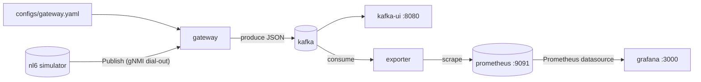
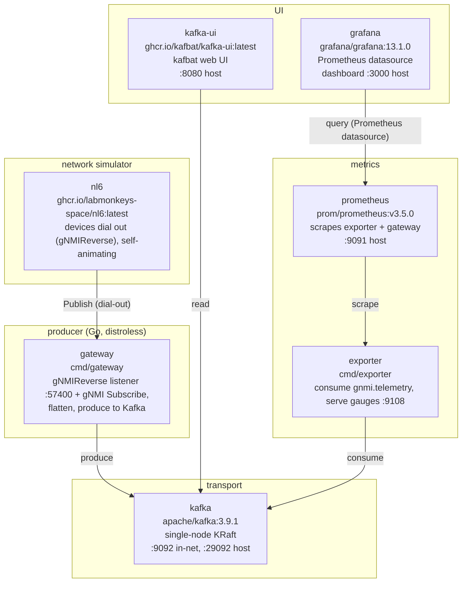

# gnmi-kafka-producer

Docker Compose stack that streams gNMI telemetry from a network simulator into
Kafka. The gateway reads a single YAML config and can be deployed and
reconfigured independently. It collects in two modes: **dial-out** (devices
push to its gNMIReverse listener — what the demo runs) and **dial-in** (it
dials targets and Subscribes).



## Components



## Quickstart

```sh
make up                       # docker compose up -d --build
make ps                       # watch services come healthy
open http://localhost:8080    # kafbat: cluster "demo", topic "gnmi.telemetry"
open http://localhost:3000    # grafana: "gNMI Telemetry (live)" dashboard (anonymous)
open http://localhost:9091    # prometheus: gnmi_* (telemetry) and gateway_* (ops) series
```

[nl6](https://nl6.eu) boots in seconds and emits self-animating telemetry
(cycling interface counters, sine-wave CPU/mem/temp), so there is no separate
stimulus generator — the data moves on its own. Its devices **dial out**: each
opens a gRPC connection to the gateway's gNMIReverse listener and pushes
telemetry, so the collector never reaches into the device network (the
firewall/NAT-friendly direction).

## Configuration

The gateway is configured by a single file, [`configs/gateway.yaml`](./configs).

```yaml
kafka:  { brokers: ["kafka:9092"], topic: gnmi.telemetry }
metrics_port: 9090
dialout:
  listen: :57400            # gNMIReverse Publish listener (plaintext without tls:)
  # tls: { cert_file: ..., key_file: ... }
  devices:                  # attribution registry, matched on Prefix.Target
    - name: nl6-dev-01
      address: 192.168.100.1
      labels: { role: leaf, region: lab, vendor: nl6 }
```

**Dial-out** (the demo): devices push standard `gnmi.SubscribeResponse`
messages over the Arista [gNMIReverse](https://aristanetworks.github.io/openmgmt/telemetry/adapters/gnmireverse/)
`Publish` RPC. Each notification carries its device identity in-band
(`Prefix.Target`, set by nl6 to the device's management IP) and is matched
against the `dialout.devices` registry — the entry's `name` and `labels` ride
on every record, exactly as for a dial-in target. Updates from unregistered
devices are dropped and counted (`gateway_dialout_unknown_target_total`).
What is collected (paths, mode, interval) is decided by the *device*; in the
demo that's nl6's `-gnmi-dialout-*` flags in `e2e/compose.yml`.

**Dial-in** coexists with dial-out (either or both; a config with neither is
rejected): declare `targets:` bound to `subscription_profiles` and
`security_profiles`, and the gateway dials and Subscribes — see the commented
sections in `configs/gateway.yaml`. Paths are grouped into named
**subscription profiles**, each with its own collection mode: `SAMPLE`
re-reads its paths every `sample_interval`; `ON_CHANGE` fires only on state
transitions (plus an optional `heartbeat_interval` resend so quiet leaves are
still confirmed alive). At startup the gateway rejects oversubscribed
targets — the same path twice, or a parent container together with one of its
own leaves among one target's bound profiles.

- **Add devices**: bump `-auto-count` on the `nl6` service in `e2e/compose.yml`
  and add a `dialout.devices:` entry per extra `192.168.100.x` address.
- **Change paths, modes, or intervals**: dial-out collection is configured on
  the device — edit the `-gnmi-dialout-*` flags on the `nl6` service
  (`-gnmi-dialout-sub-mode sample|on-change`, `-gnmi-dialout-interval`), then
  `docker compose -f e2e/compose.yml up -d nl6`. See
  [nl6's gNMI reference](https://nl6.eu) for the full leaf list.
- **Point at a real device (dial-in)**: add a target with the device's address
  and give it a security profile — mTLS via `ca_cert`/`client_cert`/`client_key`,
  and credentials via `username_env`/`password_env` (environment variable
  *names*; the values come from the container environment, never the YAML).
- **Point at a real Kafka cluster**: the `kafka:` block optionally takes
  `client_id`, `compression` (`none`/`gzip`/`snappy`/`lz4`/`zstd`), `tls` (+
  `tls_skip_verify`), and `sasl_mechanism` (`PLAIN`/`SCRAM-SHA-256`/
  `SCRAM-SHA-512`) with `username_env`/`password_env` following the same env-var
  pattern. SASL requires `tls: true` — credentials over plaintext are rejected,
  same as on the gNMI side. The demo broker is plaintext, so none of this is set.

## Metrics

With `metrics_port` set (the demo uses 9090), the gateway serves Prometheus
metrics at `http://localhost:9090/metrics`:

- `gateway_dialout_streams_active` — currently open dial-out Publish streams
  (the demo holds 3, one per nl6 device). Compare with nl6's own view at
  `GET /api/v1/gnmi/dialout/status`.
- `gateway_dialout_updates_received_total{target}` — dial-out notifications
  accepted, per registry device name.
- `gateway_dialout_unknown_target_total` — dial-out notifications dropped
  because their `Prefix.Target` matched no `dialout.devices` entry
  (deliberately unlabelled — the incoming value is peer-controlled and would
  leak cardinality; it appears in the gateway log instead).
- `gateway_subscription_up{target, profile}` — dial-in health: 1 once the
  profile has delivered a response and no subscribe error has been seen since,
  0 otherwise. A target with one rejected profile and one streaming profile
  shows as *degraded* here while its logs still scroll happily. Pair with
  `rate(gateway_records_produced_total)` to also catch silent stalls.
- `gateway_subscribe_errors_total{target, profile}` — subscribe errors.
- `gateway_records_produced_total{target}` — records successfully produced to
  Kafka (broker-acknowledged, counted in the async produce callback).
- `gateway_kafka_produce_errors_total` — failed produce attempts.
- `gateway_dial_failures_total{target}` — failed gNMI dial-in attempts (each
  is followed by a retry).

Unset `metrics_port` and the gateway opens no listener at all. The in-stack
Prometheus scrapes this endpoint too (job `gateway`), next to the telemetry
from the exporter (job `telemetry`).

## Output format

One JSON record per leaf Update, keyed by `device|interface`. Each record carries
the **full last-known state of its interface** — every leaf seen so far, not just
the leaf that triggered it — so the field set is identical across messages:

```json
{
  "device":         "192.168.100.1",
  "target":         "nl6-dev-01",
  "role":           "leaf",
  "region":         "lab",
  "vendor":         "nl6",
  "interface":      "TenGigE0/0/0/0",
  "admin_status":   1,
  "oper_status":    1,
  "in_octets":      89115667333884,
  "in_octets_bps":  8123.4,
  "out_octets":     90470118138447,
  "out_octets_bps": 9801963523.7,
  "timestamp":      "2026-06-26T08:10:01.234567890Z"
}
```

The `target` field and the label fields (`role`, `region`, `vendor` above) come
from the target's registry entry and are constant for all of a target's records,
so the field set stays stable.

The **exporter** (`cmd/exporter`) bridges this topic into Prometheus: it keeps
the last record per Kafka key and serves every numeric field as a gauge named
`gnmi_<field>` (e.g. `gnmi_in_octets_bps`, `gnmi_oper_status`), with the string
fields — `device`, `interface`, `target`, and the free-form target labels — as
Prometheus labels. Because each record already carries the full merged state,
the exporter just replaces state per key; a leaf the gateway drops (delete,
counter reset) disappears from the next scrape, a series that stops arriving
entirely (decommissioned device) stops being exported after `-stale` (15m
default), and a restarted exporter repopulates from the live stream within one
sample interval. The Grafana dashboard queries these series through the
provisioned Prometheus datasource.

- **Metric key** — the leaf name with `-`→`_` (e.g. `in_octets`), carrying the raw
  value as a JSON number.
- **Rate** — for octet counters, `<metric>_bps` = Δvalue ÷ Δt × 8 is computed at the
  source (the gateway keeps the last sample per series). It is omitted on the first
  sample and on a counter reset (and dropped from the merged state until the next
  valid delta).
- **Status** — `oper-status`/`admin-status` are emitted as numeric `oper_status`/
  `admin_status` (`UP` → 1, otherwise 0) so they are chartable. A YANG module
  prefix on the enum (`openconfig-interfaces:UP`, as nl6 sends it) is ignored.
- **Deletes** evict the leaf's rate and merged state and produce no record.

> **Breaking change**: this replaces the earlier one-metric-per-message record
> (and before that, the flat `{target, path, value}` record). Any consumer of the
> old shapes must be updated. Only `kafka-ui` (schema-agnostic) and the exporter
> read this topic in the demo.

## Commands

```sh
make logs                                  # tail all services
make tail-topic                            # console-consumer dump of first 50 records
docker compose -f e2e/compose.yml logs -f gateway
docker compose -f e2e/compose.yml logs -f nl6
make down                                  # tear down
```

## Project layout

```
.
├── configs/
│   └── gateway.yaml          # gateway config
├── e2e/
│   ├── compose.yml           # end-to-end demo stack
│   ├── grafana/              # provisioned datasource + dashboard
│   └── prometheus/           # scrape config (exporter + gateway)
├── Makefile
├── README.md
├── go.mod / go.sum
├── cmd/
│   ├── gateway/              # dial-out listener + dial-in subscribe loops
│   │   ├── Dockerfile
│   │   └── main.go
│   └── exporter/             # Kafka → Prometheus bridge (e2e stack only)
│       ├── Dockerfile
│       └── main.go
└── internal/
    ├── config/
    │   ├── config.go         # shared field types + YAML loader
    │   └── gateway.go        # Gateway type, LoadGateway, validate
    ├── dialout/server.go     # gNMIReverse Publish server (dial-out collector)
    ├── exporter/exporter.go  # record state store + Prometheus collector
    ├── gnmi/
    │   ├── client.go         # dial-with-retry, SubscribeRequest builder
    │   └── flatten.go        # gNMI Notification to []Record, TypedValue cases
    └── kafka/producer.go     # franz-go wrapper
```

## Notes

- nl6 puts each simulated device on its own IP inside a Linux TUN/network
  namespace and forwards their outbound traffic **without SNAT**, so dial-out
  connections arrive at the gateway sourced from `192.168.100.x`. The reply
  path needs a route back: nl6 holds a static address (`172.28.0.10`) on the
  compose network and the `gateway-route` sidecar (which shares the gateway's
  netns, since the gateway image is distroless) keeps
  `ip route replace 192.168.100.0/24 via 172.28.0.10` installed. No namespace
  sharing between gateway and nl6 — that coupling died with dial-in.
- The demo's dial-out is plaintext (`-gnmi-dialout-tls=false` on nl6, no
  `dialout.tls` on the gateway), mirroring the old demo's `skip_verify`
  pragmatism. Real deployments should set `dialout.tls` and drop the nl6 flag.
- Demo trade-off: nl6 dial-out runs one subscription per device, so the demo
  samples the full `/interfaces/interface[name=*]/state` subtree every 5s —
  status leaves included. The old dial-in demo's ON_CHANGE semantics for
  status are gone; the dashboard data is a superset.
- nl6 resolves the dial-out collector hostname at startup and exits if it
  can't, hence `depends_on: gateway` on the nl6 service (plus
  `restart: unless-stopped` as a belt-and-braces).
- Kafka and Prometheus data live in the container layer. `make down` wipes
  everything.
- `kafka:3.9.1` and `prometheus:v3.5.0` are pinned. `nl6` and `kafka-ui` track
  `latest`. Change in `e2e/compose.yml`.
